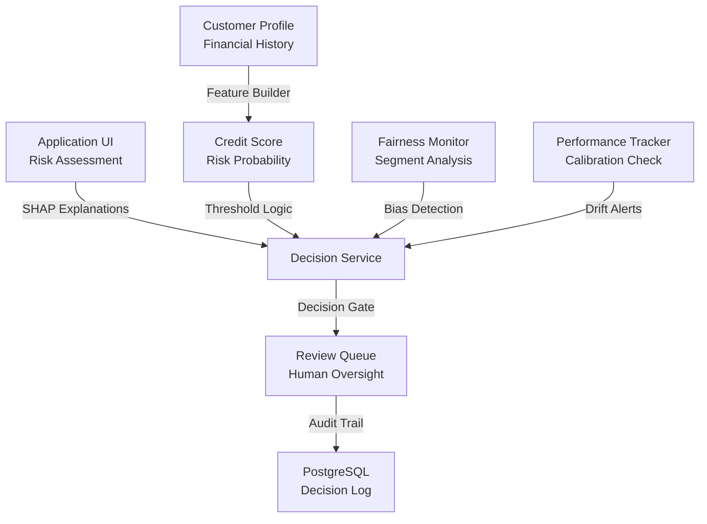

# CIF Credit Platform

Decision-support application for credit-risk decisions. Transforms risk scores into explainable and auditable lending decisions with governance, monitoring, and human-in-the-loop review.

## Overview

Infrastructure for credit intelligence and risk decision-making for financial institutions (SFD / microfinance) in West Africa. Combines machine learning scoring engine, supervised decision engine, and validation protocol designed before real-data ingestion to ensure methodology rigor.

## System Architecture



## Quick Start

```bash
# Using uv (Python environment manager)
uv sync --extra dev --extra test

# Validate anti-leakage guards
uv run pytest tests/ -q

# Run full pipeline (DVC reproducible)
uv run dvc repro

# Start API locally
uv run uvicorn cifci.api.app:app --reload
# API available at http://127.0.0.1:8000/docs
```

Docker alternative:

```bash
docker compose up -d
```

## Tech Stack

| Layer | Technology |
|-------|------------|
| Language | Python 3.11 |
| ML Framework | scikit-learn, XGBoost |
| Calibration | Isotonic regression |
| Validation | Bootstrap stratified, 95% CI |
| Model Registry | MLflow (Tracking + Model Registry) |
| API | FastAPI + Uvicorn |
| Workflow Orchestration | DVC |
| Data Versioning | DVC |
| Quality Assurance | pytest, ruff, mypy, pre-commit |
| CI/CD | GitHub Actions |

## Key Features

- **Scoring Engine** : XGBoost probability estimate for credit default
- **Calibration** : isotonic regression ensures reliable probabilities
- **Decision Logic** : risk score + profile → `APPROVAL | REVIEW | ADJUSTMENT | REJECTION`
- **Explainability** : SHAP contributions (global importance, local decisions)
- **Fairness** : segmented metrics (thin-file vs rich history) with 95% CI
- **Thin-File Handling** : targeted approach for customers with limited credit history
- **Cost Optimization** : threshold selection based on review capacity and risk costs
- **Governance** : human review gates, audit trail, decision logging

## Repository Structure

```
src/cifci/
├── data/               # Data ingestion and synthetic generation
├── features/           # Feature engineering + anti-leakage guards
├── models/             # Training, calibration, registry
├── evaluate/           # Metrics, bootstrap CI, fairness analysis
├── decision/           # Decision engine logic
├── explain/            # SHAP explanations (local + global)
├── pipeline/           # DVC and CLI orchestration
├── api/                # FastAPI scoring service
└── cli/                # Command-line tools
tests/                  # Unit and integration tests
configs/params.yaml     # Centralized parameters
dvc.yaml                # DVC pipeline definition
data/                   # Data (DVC-tracked)
models/                 # Model registry (DVC-tracked)
reports/                # Generated audit reports
docs/                   # Protocols and validation documentation
.github/workflows/      # CI/CD (ruff, mypy, pytest, anti-leakage)
```

## Validation & Compliance

**Anti-Leakage Protocol** : two-level guard
1. Blocklist: variables post-decision (e.g., `loan_status`) rejected at feature engineering
2. Correlation threshold: any feature with target correlation > 0.75 triggers blocking error

**Temporal Split** : chronological ordering prevents data leakage; never random split

**Fairness** : segmented metrics per group (gender, sector, geography) with 95% confidence intervals

**Audit**: Multi-seed validation, robustness testing, drift simulation, generalization measurement

## Experimental Results

Results on synthetic data (seed-controlled, 11.8% default rate target):

| Metric | Official Model | DVC Pipeline |
|--------|-----------------|--------------|
| ROC-AUC | ~0.83 | ~0.87 |
| PR-AUC | ~0.47 | ~0.49 |
| Brier (post-calibration) | ~0.084 | ~0.075 |
| ROC-AUC 95% CI (bootstrap) | — | [0.86, 0.88] |
| Thin-file / Rich history generalization | validated | 0.82 → 0.85 |

**Important**: These are experimental results on synthetic, calibrated data. They do not represent real CIF performance and should never be presented as benchmarks.

## Development

Install development environment:

```bash
uv sync --extra dev --extra test
```

Run validation suite:

```bash
uv run pytest tests/ -q                # test suite (14 cases, anti-leakage guard, states)
uv run dvc repro                       # full DVC pipeline
uv run ruff check .                    # linting
uv run mypy .                          # type checking
```

## Governance & Compliance

- **BCEAO/SFD Alignment** : methodology designed for regulated environment
- **Temporal Validation** : split by application date, no information leakage
- **Human-in-the-Loop** : decision engine only automates what is statistically justified
- **Decision Logging** : audit trail and journal for all lending decisions
- **Model Registry** : version control, promotion, rollback capability

## Deployment

**Current**: API in development mode with DVC pipeline execution

**Roadmap**:
- Real CIF data ingestion (shadow mode)
- Production FastAPI deployment
- Model monitoring (drift detection, performance tracking)
- Extended features (portfolio intelligence, early warning)

---

**Status**: Methodology phase complete and frozen. Ready for real-data audit on CIF anonymized data.
